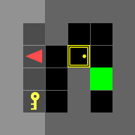
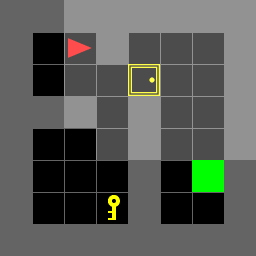
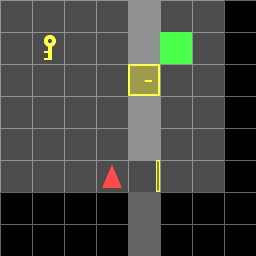
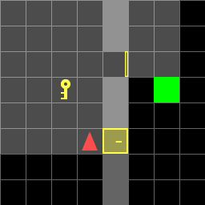
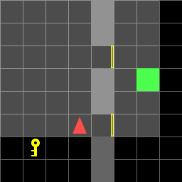

# Dynamic Programming For Door Key Problem
## Overview
This code models the standard door key problem as a Markov Decision Process and solve it using Dynamic Programming Algorithm. The problem is split as 2 parts. The objective for both parts is to implement a Dynamic
Programming algorithm that minimizes the cost of reaching the goal. Mathematically,

$$
min\, V_t^{\pi}\left ( x \right ):= q\left ( x_T \right )+\sum_{\tau =t}^{T-1}l\left ( x_{\tau},\pi_t\left ( x_\tau \right ) \right )
$$

## Part A:
Standard maps of size 5x5, 6x6 and 8x8 is given with random goal and key position. The placement of them is also given as input in the environment variable. There will only be one door which might or might not block the path to the key. The goal is to run DP on every input map and find an optimal path sequence. Example of the map is given below:
|           doorkey-5x5           |            doorkey-6x6            |            doorkey-8x8            |
| :-------------------------------------: | :--------------------------------------: | :----------------------------------------: |
|  |  |  |


## Part B:
We are given a set of 36 environments and run DP once which computes one general policy for all the environment.
|           doorkey-8x8-normal            |
| :-------------------------------------: |
|  |

## Results
Some of the results obtained are shown below:
|          doorkey-5x5                |          doorkey-6x6                   |            doorkey-8x8                 |
|-------------------------------------|----------------------------------------|----------------------------------------|
|  |  |  |

|          Random Map 3               |          Random Map 18                 |          Random Map 29                 |
|-------------------------------------|----------------------------------------|----------------------------------------|
|  |  |  |


## Code Implementation
### Installation
- Install Python version `3.7 ~ 3.10`
- Install dependencies
```bash
pip install -r requirements.txt
```
### File Structure
### 1. doorkey.py
This is the main entry point for the algorithm

### 2. parta.py
Implements a class to solve problem part A.

### 3. partb.py
Implements a class to solve problem part B.

### 4. utils.py
Useful functions that is used to operate in gym is implemented here
- **step()**: Move your agent
- **generate_random_env()**: Generate a random environment for debugging
- **load_env()**: Load the test environments
- **save_env()**: Save the environment for reproducing results
- **plot_env()**: For a quick visualization of your current env, including: agent, key, door, and the goal
- **draw_gif_from_seq()**: Draw and save a gif image from a given action sequence.

### 5. gif
This folder contains the result in the form of gif

### 6. envs
This folder contains the .env files which serves as input to the algorithm to construct and operate on the environment.
